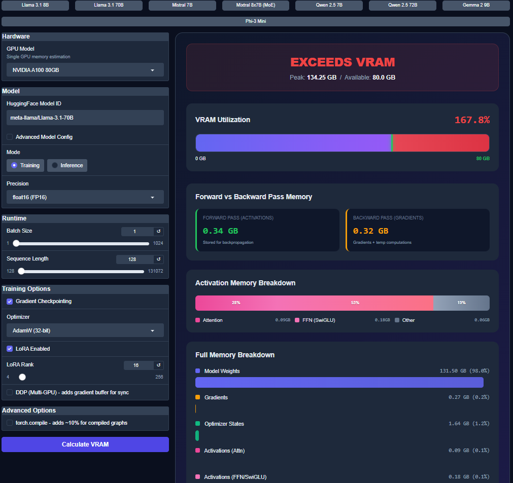

# LLM VRAM Calculator

A comprehensive tool for estimating GPU memory requirements for Large Language Model (LLM) training and inference. Supports both dense transformers and Mixture of Experts (MoE) architectures with detailed memory breakdowns.


## Features

- **Accurate VRAM Estimation** - Calculate memory requirements for training (full fine-tuning, LoRA) and inference
- **MoE Support** - Proper handling of Mixture of Experts models (Mixtral, DeepSeek) with active parameter calculations  
- **Detailed Breakdown** - See exactly where memory goes: weights, gradients, optimizer states, activations, KV cache
- **Precision Controls** - Streamlined 16-bit, FP32, INT8, and INT4 precision options
- **Training Optimizations** - Gradient checkpointing, 8-bit optimizers, DDP overhead estimation
- **Auto-Detection** - Fetches model configs from HuggingFace or uses built-in presets
- **Custom GPU Presets** - Add your own GPU specs in the UI and persist them locally
- **Interactive UI** - Gradio web interface with real-time calculations

Note: I haven't spent too much time testing the manual config setup or huggingface loading versatility.

## Memory Components Calculated

| Component | Training | Inference |
|-----------|----------|-----------|
| Model Weights | ✓ | ✓ |
| Gradients | ✓ | - |
| Optimizer States (AdamW/SGD/Adafactor) | ✓ | - |
| Activations (Attention + FFN + SwiGLU) | ✓ | ✓ |
| KV Cache | - | ✓ |
| DDP Gradient Buffers | ✓ | - |
| torch.compile Overhead | ✓ | ✓ |
| CUDA Context | ✓ | ✓ |



## Installation

```bash
# Clone the repository
git clone https://github.com/dankit/llm-vram-calc.git
cd llm-vram-calc

# Install dependencies
pip install -r requirements.txt
```

## Usage

### Web Interface

```bash
python vram_calculator.py
```

Then open `http://localhost:7860` in your browser.

### Programmatic Usage

```python
from vram_calc import VRAMInput, estimate_vram, GPU_SPECS

inp = VRAMInput(
    model_id="meta-llama/Llama-3.1-8B",
    gpu_name="NVIDIA RTX 4090 24GB",
    mode="Training",
    dtype="16-bit (BF16/FP16)",
    batch_size=1,
    seq_length=2048,
    gradient_checkpointing=True,
    optimizer="AdamW (32-bit)",
    lora_rank=16,
    lora_enabled=True,
)
estimate = estimate_vram(inp)

print(f"Total VRAM: {estimate.total_gb:.2f} GB")
print(f"Fits in GPU: {estimate.fits}")
print(f"Utilization: {estimate.utilization_pct:.1f}%")
```

The compatibility shim `from vram_calculator import calculate_vram, GPU_SPECS` still works with the original keyword-style `calculate_vram(...)` API.

## Supported Models

### Built-in Presets

| Model Family | Models |
|--------------|--------|
| Llama | 3.2-1B, 3.2-3B, 3.1-8B, 3.1-70B, 3.3-70B |
| Mistral | 7B-v0.3, Mixtral-8x7B, Mixtral-8x22B |
| Qwen | 2.5-0.5B, 2.5-1.5B, 2.5-7B, 2.5-14B, 2.5-72B |
| Phi | phi-3-mini, Phi-3.5-mini |
| Gemma | 2-2b, 2-9b, 2-27b |
| DeepSeek | V2-Lite, Coder-V2 |

Any HuggingFace model with a `config.json` can be auto-detected.

## Supported GPUs

Built-in defaults are intentionally compact and modern:

- NVIDIA GH200, H200, H100 SXM, A100, L40S
- NVIDIA RTX 5090, RTX 4090
- AMD Instinct MI300X

Custom GPUs can be added from the **Add Custom GPU** section in the UI. Saved entries are persisted to `vram_calc/data/custom_gpus.json`.

## MoE (Mixture of Experts) Handling

For MoE models like Mixtral and DeepSeek:

- **Total Parameters**: All experts are loaded into VRAM
- **Active Parameters**: Only `experts_per_token` experts run per forward pass
- **Activations**: Scale with active experts, not total experts
- **Gradients/Optimizer**: Still need full parameter storage for training

Example: Mixtral-8x7B has 46.7B total parameters but only ~12.9B active per token.

## Calculation Details

### Model Weights
```
weights_gb = (params_b × 1e9 × bytes_per_param) / (1024³)
```

### Gradients (Mixed Precision)
```
gradients_gb = (trainable_params × 2 bytes) / (1024³)  # FP16
master_weights_gb = (trainable_params × 4 bytes) / (1024³)  # FP32 copy
```

### Optimizer States
| Optimizer | Memory |
|-----------|--------|
| AdamW 32-bit | 8 bytes/param (m + v in FP32) |
| AdamW 8-bit | 2 bytes/param (m + v in INT8) |
| SGD | 4 bytes/param (momentum) |
| Adafactor | 4 bytes/param (factored) |

### Activations (per layer)
```
attention = batch × seq × hidden × (1 + 3 + seq/hidden × heads + 1) × 2 bytes
ffn_swiglu = batch × seq × intermediate × 3 × 2 bytes
```

### KV Cache (Inference)
```
kv_cache = 2 × batch × layers × seq × kv_heads × head_dim × dtype_bytes
```

## Contributing

Contributions are welcome! Please feel free to submit issues and pull requests.


## Acknowledgments

- Built with [Gradio](https://gradio.app/) for the web interface
- Model architectures referenced from HuggingFace Transformers
